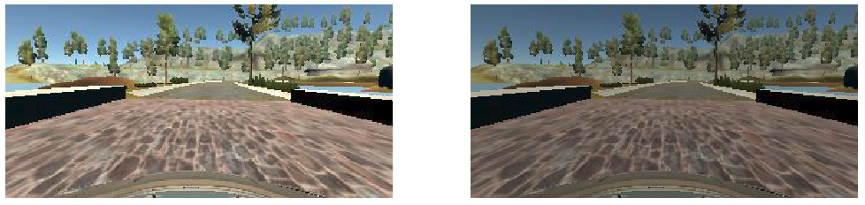
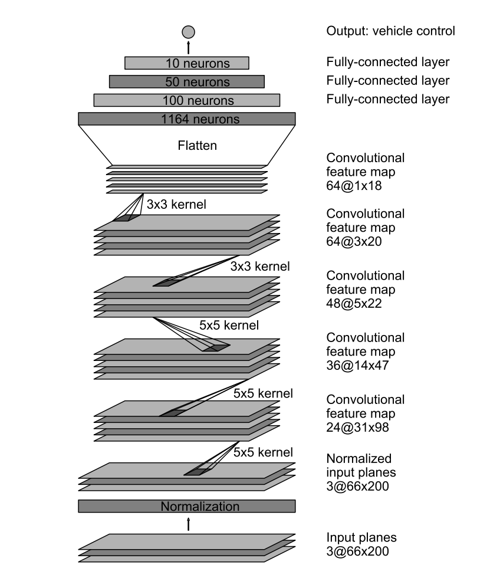

**Behavioral Cloning** 
---
## Overview
In this project for Udacity's Self Driving Car Nano Degree Program, we explored end-to-end learning technique for self driving cars.  In a simulated environment, we teach a deep neural nework how to drive a car by cloning an expert's behaviour. Specifically, a deep neural network is implemented to learn the mapping from image data from cameras in the car to steering angles, which are provided by an expert drver.

**Discussion**
--

## Exploring Driving Data
First, I explored how the data is distributed for steering angle. As one can see from the graph above, it can be seen that the steering command values around 0 degrees have a dominating presence in the dataset:

In machine learning, it is generally known fact that scewed dataset makes it hard to build robust models. Within the context of self-driving cars, I theoreticized that if the neural network were to taught to drive in a straight line for most of the time, it will probably drive in a straight line if it encounters unexpected scenes while driving. The observed behaviour of the network during testing seemed verify this theory. Whenever the car failed to make a sharp turn, it would do so by insisting on travelling in a straight path. I subsampled the dataset by randomly dropping any data points with steering angle value less than 0.05 degrees and their corresponding input images. The result is more balanced dataset:

## Driving Data Augmentation
While exploring the dataset, it became clear that the dataset has to be augmented. There are spots in the simulated driving course with shawdows from trees. However, if the car were to learn what to do when it sees sahdows, it would need more examples from an expert to handle such situations. I augmented the data with random brightness changes to help with this issue:

It was also mentioned in the course that the driving course is designed with more left turns than right turns. The neural network will not be able to learn good driving habbits to accomodate for the right turns if we just used the original daata. To mitigate this issue some of the images and settering angles were selected to be flipped horizontally:

Also, it is expected that the neural network will not be able to perfectly copy the expert's behaviour from the training dataset. This will mean that the car will run into situations that is not recored in the origianl training dataset. In order to build a robust driving model, I added random translation to the input images and modified the steering angles accordingly in order to simulate driving from many different positions and orientations in the course. Some of the examples of this augmentations are shown below.

## More Data
After augmentation, I was able to get the car to drive the full course. However on sharp turns, the deep neural network would do something that would not be considered safe if humans were the drivers. I added one lap of data for each of those sharp turns to ensure that the network learns proper policies to make those turns. In the end, I ended up with 9000 data points for training a network that successfully drives around the course.

## Training/Validation/Test Data Split
I splitted the given data into training, validation and test data in 80/10/10 ratio to make sure I can verify my experiments with the deep neural net arcitecture and data augmentation/composition.

## Deep Neural Net Arcitecture 
For my project, I decided to use the NVIDIA model as shown in the digram below:

## Training
I used Adam optimization as the gradient descent alogirthm and Mean Squared Error as the cost function for training. After few trials, I found out that Adam optimizer is better to be trained with a learning rate of 1e-4, instead of the default 1e-3. I also discovered that 5 epochs is enough to train a robust model.

Morover, a batch size of 128 was used to train the neural network. I used Keras' `fit_generator` to make sure batches are generated in online rather than having to store and keep the entire dataset in the memory.

## Video
The link to download the video of my training result can be found [here](./run1.mp4)
